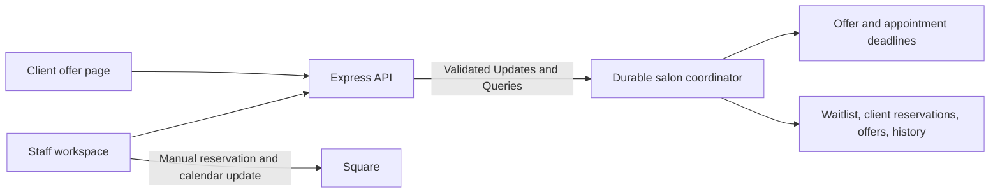

# Juniper Salon — cancellation concierge

A working Temporal prototype for Lena and Carla. Keep confirmed appointments in Square, replace the waitlist spreadsheet with a calm staff workspace, and offer each newly open appointment to one eligible client at a time.

## Run locally

Requirements: Node.js 20+ and Docker Desktop running.

```sh
npm install
npm run dev
```

On Windows PowerShell, use `npm.cmd install` and `npm.cmd run dev` if execution policy blocks `npm.ps1`. The launcher supports Windows and starts Docker's Temporal service, the Node API, and the Temporal worker. Keep it running.

- Staff workspace: http://localhost:3000
- Temporal Web UI: http://localhost:8233
- Workflow ID: `juniper-salon-v1`; task queue: `juniper-salon`; namespace: `default`.
- The client page opens from **Open client offer** in an opening's details. Use the same computer for a phone-sized browser preview. For a physical phone on the same trusted network, use the computer's LAN address in place of `localhost`; firewall access may be required.

The app starts empty. Choose **Add fictional clients for a demo**, then create a Haircut opening with Jessica. Three fictional clients match, so you can demonstrate progression. All forms and displayed times use America/Los_Angeles. This prototype handles same-day openings. Sample availability is only for the day it is added.

## What Lena asked for

- Lena and Carla manage openings and the waitlist; Square remains the appointment calendar.
- Match service, stylist preference, duration, and availability covering the entire requested service. Prioritize the earliest eligible waitlist request.
- Offer one client 15 minutes, then automatically move on after a decline or timeout. A client must never hold two offers across different openings.
- Show the current holder, countdown, previous outcomes, remaining candidates, and the final result.
- Let clients accept or decline on a phone. Simulated text is sufficient for the prototype and is explicitly labeled.
- Reject expired and cancelled links. Acceptance fills the opening and removes only that waitlist request; declines and timeouts preserve it for future openings.
- Staff check and reserve the time in Square before outreach. After acceptance, show **Square update pending** until staff mark it complete. Staff also move/cancel existing bookings and notify stylists.
- Prioritize reliable progression without competing acceptances. The business target is refilling at least half of last-minute cancellations with less manual checking. The dashboard shows a simple daily fill rate; sample data cannot establish real business impact.

## Suggested demonstration

1. Add fictional clients. Create a same-day Haircut with Jessica, at least 45 minutes long, fitting entirely within today. Confirm the Square reservation checkbox.
2. Select **20-second offers for this demo** to observe real Temporal timers quickly. The production-style default remains 15 minutes.
3. Watch Maya's offer expire without clicking anything. Olivia receives the next offer and the history records the timeout.
4. Open Maya's old link from the message history: it cannot accept the opening.
5. Open Olivia's link and accept. The opening is filled, her request leaves the waitlist, and Square is marked pending. Mark the manual calendar update done.
6. Try another opening, then cancel it. Its client link displays an apology and has no acceptance action.
7. Show the Temporal event history and the automated restart/concurrency tests described below.

For a manual worker-restart demo, stop the combined launcher first, then run these in separate terminals (Docker can remain running):

```sh
npm run dev:api
npm run dev:worker
```

Create an opening, stop only the worker with Ctrl+C, wait past an offer deadline, and restart `npm run dev:worker`. The timer and saved history survive. The next client gets a new offer on recovery. The automated integration test verifies this scenario and preservation of accepted bookings.

## Temporal design



`salonWorkflow` is a long-lived coordinator for this single small salon. It owns waitlist entries, openings, offer tokens, client claims, and history in Temporal's persisted workflow state. A single coordinator deliberately makes reservations across openings atomic; independent per-opening workflows alone would not prevent two openings from offering the same client.

- **Durable timers:** `condition` waits until a command arrives or the nearest offer/appointment deadline. Browser countdowns are display only. Closing the browser does not stop progression.
- **Workflow Updates:** staff actions and client replies are synchronous, validated state transitions. Handlers contain no `await`, so acceptance, cancellation, and client reservation cannot interleave. Commands check deadlines before applying, including after worker downtime.
- **Queries:** the staff view reads a status snapshot. The client query returns only its own offer details, not the waitlist or other clients' contact information.
- **Replay and persistence:** Temporal's Docker volume retains workflow history across application restarts. Continue-As-New carries the current state forward when Temporal recommends history rotation.
- **Idempotency:** Temporal Update IDs protect retried commands carrying the same key. Repeated acceptance of the same accepted offer is also safe. Duplicate active requests and overlapping stylist openings are rejected.
- **Simulated notifications:** a recorded offer and its stable client link constitute the simulated text. No external service is called, so no placeholder Activity is needed. A real SMS integration would send through an idempotent Activity with bounded retries and delivery-state handling.

The regular API has no process-local booking database. Restarting it does not clear the waitlist or appointments. `src/salon.ts` contains deterministic business rules, called exclusively by the workflow for mutations.

## Explicit prototype assumptions and limits

- One exact date/time availability window per request. Recurring phrases such as “weekday afternoons” must be entered as a concrete window. Service duration is entered by staff; there is no invented salon pricing or duration catalogue.
- Joining the waitlist expresses interest in matching openings. A normalized mobile number identifies the client for the one-offer-at-a-time rule; shared family phone numbers consequently share this restriction.
- Busy clients are temporarily skipped. If all untried matches are busy, the opening waits and reconsiders automatically when their other offers end. With no untried matches, it ends unfilled; adding clients later does not reopen it.
- Outreach ends at the appointment start. A late-created offer has less than 15 minutes and displays its actual remaining time. No additional travel-time rule was specified.
- **Withdraw & move on** cancels only the current offer. **Cancel opening** stops all outreach. Removing a waitlist request withdraws its active offer. Accepted appointments are managed manually in Square.
- Replies must be processed and validated before the deadline. While the worker/API is unavailable, the UI must not promise acceptance. A delayed Update may be rejected after recovery; no SMS inbox or provider-timestamp grace policy is simulated.
- No real SMS, Google Sheets import, or Square integration. Staff reservation confirmation is an operational safeguard; this app cannot prevent an independent booking made directly in Square.
- Local assessment prototype, without staff authentication, tenancy, or production access controls. Use fictional data and a trusted local environment. Do not expose the staff API publicly as-is. Offer URLs are bearer links and should not be shared with other clients.
- All state remains in a single coordinator. It is appropriate for this bounded demonstration; production would need archival, payload limits, workflow versioning, and a persistent read model as volume grows.
- The only external visual dependency is Google Fonts; the interface has local system-font fallbacks.

## Verification

Start Docker's Temporal service first:

```sh
npm run start:temporal
npm run typecheck
npm test
```

`npm test` runs business-rule tests and a real Temporal integration test on a unique task queue/workflow. It needs the local Temporal server, but starts its own worker and does not mutate the salon workflow. Tests cover eligibility, FIFO, simultaneous client claims, duplicate/stale acceptance, deadlines, withdrawal, cancellation, request removal, Square status, overlapping appointments, worker restart, and replay. Test workflows are terminated during cleanup.

For desktop/mobile browser checks, keep `npm run dev` running (the worker is needed), then:

```sh
npx playwright install chromium
npm run test:ui
```

Playwright launches a separate API on port 3100 with a unique workflow ID. It verifies the staff and phone offer flows, decline-to-next progression, acceptance, Square completion, timeouts, cancellation, stale links, and viewport overflow. It saves screenshots in `evidence/`. Browser-test workflows remain visible in Temporal as assessment evidence and are separate from `juniper-salon-v1`.

See [evidence/README.md](evidence/README.md) for screenshots and verification notes.

## Repository map

- `src/workflows.ts`: durable coordinator, timers, Updates, Queries, history rotation.
- `src/salon.ts`: eligibility, reservation, progression, and acceptance rules.
- `src/api.ts`: validation, Temporal client, staff and offer endpoints.
- `src/types.ts`: shared state and command types.
- `src/worker.ts`: Temporal worker.
- `public/`: responsive staff and client interfaces.
- `tests/`: business-rule, real Temporal, and browser tests.

Prepared in a new public repository, not a GitHub fork, using Stanford's provided Temporal assessment starter.
